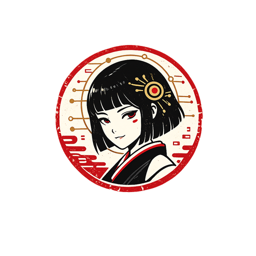

<div align="center">



# Loukri AI CoWork

_an AI workspace for VVIT, powered by [TokenKey](https://tokenkey.in) inference (tokenkey.in) — built on the open-source [goose](https://github.com/aaif-goose/goose) agent_

<p align="center">
  <a href="https://opensource.org/licenses/Apache-2.0"
    ></a>
</p>

</div>

Loukri AI CoWork is a desktop AI agent that runs locally on your machine — for code, research, writing, automation, and data analysis. It is a branded distribution of goose (Apache-2.0) with **TokenKey (tokenkey.in)** as the only AI service provider.

- Sign in with your own `tk_live_...` TokenKey API key (created in the [TokenKey console](https://tokenkey.in); see the [API docs](https://tokenkey.in/docs))
- Models: `tk-auto` (recommended default) and `tk-base`
- Telemetry is disabled by default
- Jarvis design language: cream `#fcf6e6`, ink `#0f172c`, accent `#f0a06f`, Inter + JetBrains Mono

## Build (Windows)

See **[REBRANDING.md](REBRANDING.md)** for the full list of changes vs upstream, provider configuration, and build instructions:

```bash
cargo build --release --target x86_64-pc-windows-msvc -p goose-cli --bin goose
cp target/x86_64-pc-windows-msvc/release/goose.exe ui/desktop/src/bin/
cd ui && pnpm install && pnpm --filter loukri-cowork make
```

## Upstream

Everything not listed in REBRANDING.md is upstream goose, governed by the [Agentic AI Foundation (AAIF)](https://aaif.io/) at the Linux Foundation:

- Upstream README and docs: [goose-docs.ai](https://goose-docs.ai)
- [Custom Distributions guide](CUSTOM_DISTROS.md) — the upstream playbook this distribution followed
- Original license preserved in [LICENSE](LICENSE); this distribution indicates its modifications per Apache-2.0 §4
